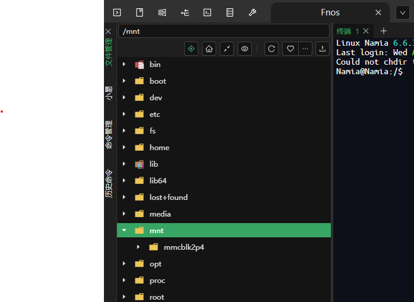
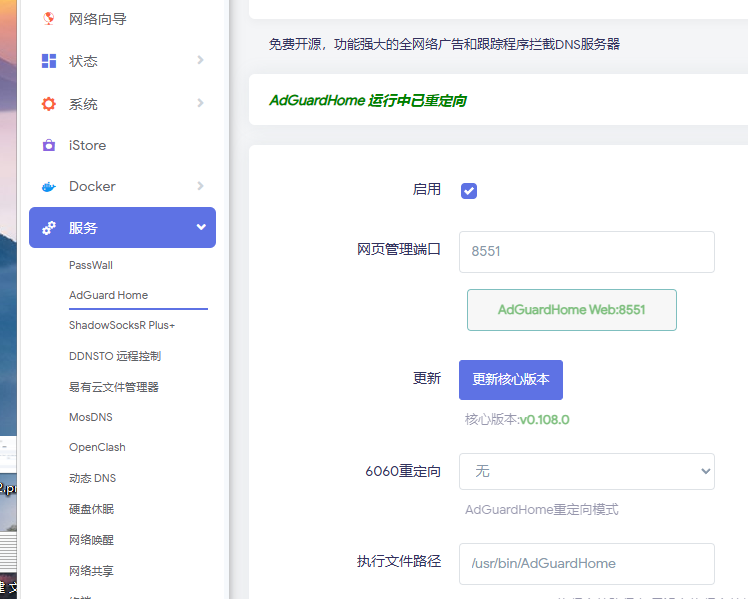
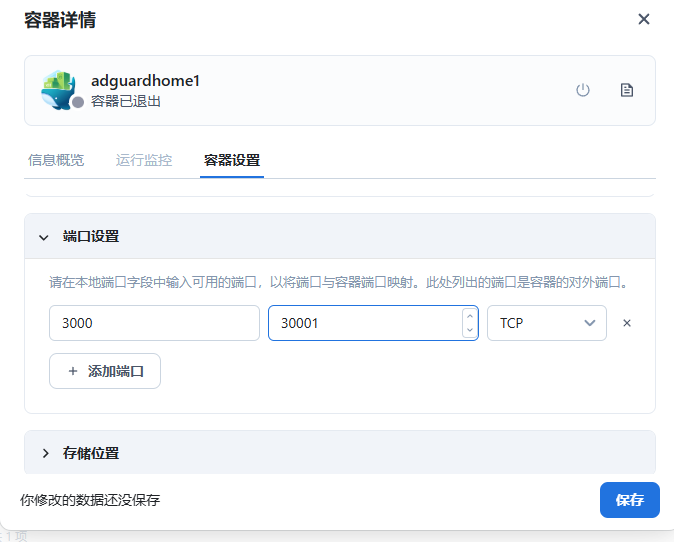

# 双AdGuardHome及OpenWrt商店及Linux部分工具合集以及DNS收集 by [Namia-X]

### 附赠[`国内外广告部分拦截黑名单和白名单`](https://raw.githubusercontent.com/Kevin-R1/Two-docker-agd/refs/heads/main/AdGuard%E6%A8%A1%E6%9D%BF/%E5%B9%BF%E5%91%8A%E6%8B%A6%E6%88%AA%E9%BB%91%E5%90%8D%E5%8D%95.txt)

## 1 双AdGuardHome一键安装脚本即使用方法举一反三

### 1.1 **基于你已经安装了docker版agd可以使用模板进行复制和上传，或者Docker版自己配置**
- 1 本身附带有AdGuardHome并且在服务里面找到了AdGuardHome你可以直接复制AdGuardHome-cn.yaml此文件里面的，在AdGuardHome模板手动复制粘贴就行，自己找的ipk及run安装包一样方法使用模板。
2 -基于你使用Docker 命令1.2创建的AdGuardHome，文件夹找到 /mnt/mmcblk2p4/adg/confdir1，如果没有就1.2创建并且上传AdGuardHome.yaml到confdir1此为docker版本配置的yaml文件上传路径，相反你也可以ip3000自己配，博主本人模板只是把它当作了第二dns用作拦截国外广告。
3 如何搭配mosdns或者smtdns运行看你自己，服务的的agd不作为dns服务器选择无
4 如果你用我模版记得看对应端口转发和访问端口转发如果不喜欢自行改，分别是，管理 ip:8553.ip:8554/监听127.0.0.1:8553.127.0.0.1:8554。
5 二选一不需要删掉固件自带的agd，你也可以全docker板agd。

### 1.2 其他固件如X86和RK瑞芯微处理器下的op和带Docker的设备
### 创建文件夹
```
mkdir -p /mnt/mmcblk2p4/adg
```
### 下载并运行脚本
```
wget https://raw.githubusercontent.com/Kevin-R1/Two-docker-agd/main/adg.sh && sh adg.sh
```
### 直接二次运行脚本进入交互菜单
```
 .adg.sh
```
### 操作顺序
```
3,1,1,1,1,0,0,3,1,1
```
## 2 OpenWrt悟空的日常 所撰写的iStore商店和设置向导


# 双AdGuardHome及OpenWrt商店及Linux部分工具合集以及DNS收集 by [Namia-X]
### 附赠[`国内外广告部分拦截黑名单和白名单`](https://raw.githubusercontent.com/Kevin-R1/Two-docker-agd/refs/heads/main/AdGuard%E6%A8%A1%E6%9D%BF/%E5%B9%BF%E5%91%8A%E6%8B%A6%E6%88%AA%E9%BB%91%E5%90%8D%E5%8D%95.txt)
### 1  双AdGuardHome一键安装脚本即使用方法举一反三
### 1.1**基于你已经安装了docker版agd可以使用模板进行复制和上传，或者Docker版自己配置**
- 1 本身附带有AdGuardHome并且在服务里面找到了AdGuardHome你可以直接复制AdGuardHome-cn.yaml此文件里面的，在AdGuardHome模板手动复制粘贴就行，自己找的ipk及run安装包一样方法使用模板。
- 
- 2 基于你使用Docker 命令1.2创建的AdGuardHome，文件夹找到 /mnt/mmcblk2p4/adg/confdir1，如果没有就1.2创建并且上传AdGuardHome.yaml到confdir1此为docker版本配置的yaml文件上传路径，相反你也可以ip3000自己配，博主本人模板只是把它当作了第二dns用作拦截国外广告。
- 3 如何搭配mosdns或者smtdns运行看你自己，服务的的agd不作为dns服务器选择无
- - 。
- 如果你用我模版记得看对应端口转发和访问端口转发如果不喜欢自行改，分别是，管理 ip:8553.ip:8554/监听127.0.0.1:8553.127.0.0.1:8554。
- 4二选一不需要删掉固件自带的agd，你也可以全docker板agd。
- 

### 1.2其他固件如X86和RK瑞芯微处理器下的op和带Docker的设备，！打个比方如NAS设备FnOS如要使用此脚本，还需要手动创建1-2个文件夹路径！！！然后继续运行脚【[全程数字操作！】
```
mkdir -p /mnt/mmcblk2p4/adg
```
这个命令适合N1下的openwrt直接创建
```
wget https://raw.githubusercontent.com/Kevin-R1/Two-docker-agd/main/adg.sh && sh adg.sh
```
加速脚本
```
bash -c "$(curl -fsSL https://raw.githubusercontent.com/Kevin-R1/Two-docker-agd/main/adg.sh)"
```
直接运行脚本进入交互菜单
```
sudo ./adg.sh
```
操作顺序
```
3，1，1，1，1，0，0，3，1，1
```
如果其他设备端口3000被占用记得更改。
- 
# luci-app-mosdns
```
sh -c "$(curl -ksS https://raw.githubusercontent.com/Kevin-R1/Two-docker-agd/main/luci-app-mosdns.sh)"
```
#  2 OpenWrt[`悟空的日常`]( https://github.com/wukongdaily) 所撰写的iStore商店和设置向导
### 2.1**安装iStore商店(ARM64 & x86-64通用)**
```
     wget -qO imm.sh https://cafe.cpolar.top/wkdaily/zero3/raw/branch/main/zero3/imm.sh && chmod +x imm.sh && ./imm.sh
```
### 2.2安装网络向导和首页(ARM64 & x86-64通用)
```
     is-opkg install luci-i18n-quickstart-zh-cn
```
# 3 二款全功能的Linux管理脚本！[`kejilion`]( https://github.com/kejilion/sh) [`eooce`]( https://github.com/eooce/ssh_tool) 
### 3.1 家用Linux工具箱
```
curl -sS -O https://raw.githubusercontent.com/kejilion/sh/refs/heads/main/cn/kejilion.sh && chmod +x kejilion.sh && ./kejilion.sh
```
二次运行
```
./kejilion.sh
```
### 3.2 搭建节点vps合集工具箱
```
curl -fsSL https://raw.githubusercontent.com/eooce/ssh_tool/main/ssh_tool.sh -o ssh_tool.sh && chmod +x ssh_tool.sh && ./ssh_tool.sh
```
二次运行
```
./ssh_tool.sh
```
# 4 DNS收集服务器列表，按**国内**和**国外**分类。
### 1 **国内DNS服务器**
1.1 腾讯 DNS
腾讯 DNS 基于 BGP Anycast 技术，不论用户身在何地，都可就近访问服务。支持谷歌 ECS 协议，配合 DNSPod 权威解析，可以给用户提供出最准确的解析结果，承诺不劫持解析结果。
```
IPV4: 119.29.29.29
IPV6: 2402:4e00::
DoH: https://doh.pub/dns-query
DoH(IP): https://1.12.12.12/dns-query
DoH(IP):  https://120.53.53.53/dns-query
DoH(国密): https://sm2.doh.pub/dns-query
DoT: dot.pub
DoT(IP): 1.12.12.12
DoT(IP): 120.53.53.53
```
1.2 阿里 DNS
阿里 DNS 线路支持包括电信、移动、联通、鹏博士、广电网、教育网及海外 150 个国家或地域，支持用户 ECS 扩展技术，智能解析；支持 DoT/DoH 协议，保护用户隐私，安全防劫持。

     IPv4：223.5.5.5
     IPv4：223.6.6.6
     DoH：https://223.5.5.5/dns-query
     DoH：https://223.6.6.6/dns-query
     DoH：https://dns.alidns.com/dns-query
     DoT：dns.alidns.com
1.3 360DNS

     DoH：https://doh.360.cn/dns-query	
     DoT：dot.360.cn

1.4 台湾Quad 101

     IPv4：101.101.101.101	
     IPv4：101.102.103.104
     DoH：https://dns.twnic.tw/dns-query

### 2 **国外DNS服务器**
   
2.1 Google DNS

     IPv4：8.8.8.8
     IPv4：8.8.4.4
     DoH：https://dns.google/dns-query
     DoT：dns.google
     
2.2 IBM Quad9

     IPv4：9.9.9.9
     IPv4：9.9.9.11
     IPv4：149.112.112.112
     DoH：https://dns.quad9.net/dns-query
     DoH：https://dns11.quad9.net/dns-query
     DoT：dns.quad9.net
 
#不安全：没有恶意软件阻止，没有 DNSSEC 验证（仅限专家！）

     IPv4：9.9.9.10
     IPv4：149.112.112.10
     DoH：https://dns10.quad9.net/dns-query
     DoT：dns10.quad9.net
     
2.3 👍CleanBrowsing DNS

#安全保护：阻止对网络钓鱼、垃圾邮件、恶意软件和恶意域的访问。

     IPv4：185.228.168.9
     IPv4：185.228.169.9
     DoH：https://doh.cleanbrowsing.org/doh/security-filter/
     DoT：dns.cleanbrowsing.org
 
#成人保护：阻止访问所有成人、恶意和网络钓鱼网站。它不会阻止代理、混合内容网站（如 Reddit）

     IPv4：185.228.168.10
     IPv4：185.228.169.11
     DOH：https://doh.cleanbrowsing.org/doh/adult-filter/
     DOT：dns.cleanbrowsing.org
 
#家庭保护:阻止访问所有成人、恶意、网络钓鱼、混合内容网站（如 Reddit）、阻止用于绕过过滤器的代理、Google、Bing 和 Youtube 设置为安全模式。

     IPv4：185.228.168.168
     IPv4：185.228.169.168
     DoH：https://doh.cleanbrowsing.org/doh/family-filter/
     DoT：dns.cleanbrowsing.org
2.4 👍OpenDNS

     IPv4：208.67.222.222
     IPv4：208.67.220.220
     DoH：https://doh.opendns.com/dns-query
     DoH：https://doh.familyshield.opendns.com/dns-query
     
2.5 Cloudflare DNS

     IPv4：1.0.0.1
     IPv4：1.1.1.1
     DoH：https://1.1.1.1/dns-query
     DoH：https://1.0.0.1/dns-query
     DoH：https://cloudflare-dns.com/dns-query
     DoT: one.one.one.one
     DoT: 1dot1dot1dot1.cloudflare-dns.com
     
2.6 AdGuard DNS
AdGuard DNS 是屏蔽互联网广告的安全方法。它不需要您安装任何应用程序。在任何设备上都设置简单、使用便捷、免费，并且为您提供屏蔽广告、计数器、恶意网站和成人内容的功能。

#无过滤，不拦截

     IPv4：94.140.14.140
     IPv4：94.140.15.15
     DoH：https://dns-unfiltered.adguard.com/dns-query
     DoT：dns-unfiltered.adguard.com
     DoQ：dns-unfiltered.adguard.com
 
#过滤广告和跟踪

     IPv4：94.140.14.14
     IPv4：94.140.15.15
     DoH：https://dns.adguard.com/dns-query
     DoT：dns.adguard.com
     DoQ：dns.adguard.com
 
#家庭过滤：开启安全搜索和安全模式选项、拦截成人内容，并且屏蔽广告和跟踪器

     IPv4：94.140.14.15
     IPv4：94.140.15.16
     DoH：https://dns-family.adguard.com/dns-query
     DoT：dns-family.adguard.com
     DoQ：quic://dns-family.adguard.com
     
2.7 DNS.SB

     IPv4：185.222.222.222
     IPv4：45.11.45.11
     DoH：https://doh.dns.sb/dns-query
     DoH：https://doh.sb/dns-query
     DoT：dot.sb

2.8 日本 IIJ DNS

     DoH：https://public.dns.iij.jp/dns-query

### **使用说明**
1. **国内DNS**：适合访问国内网站，速度快，推荐阿里DNS、腾讯DNS、360DNS。
2. **国外DNS**：适合访问国际网站，隐私保护强，推荐Cloudflare DNS、Google DNS。
3. **Windows**：在“网络设置”中配置DoH或DoT。
4. **路由器**：在路由器管理界面中配置DoT。
5. **手机**：在“私人DNS”设置中配置DoT。

