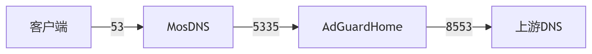

# AdGuardHome 双模式部署指南📦 
## 附赠[`国内外广告部分拦截黑名单和白名单`](https://raw.githubusercontent.com/Kevin-R1/DIY-Collection/refs/heads/main/AdGuard%E6%A8%A1%E6%9D%BF/%E5%B9%BF%E5%91%8A%E6%8B%A6%E6%88%AA%E9%BB%91%E5%90%8D%E5%8D%95.txt)

### 方案1：OpenWrt固件内置版
- 使用固件自带AdGuardHome
- 直接粘贴 AdGuardHome-cn.yaml 内容到模板
- 重启服务生效
- 保持默认DNS服务端口（如53）或者通过Web界面（IP：3000端口）更改监听
- 博主模板已通过Web更改固件自带AdGuardHome:3000管理端口为8551,Docker为8552监听固件自带8553,Docker为8554进行管理界面 
#### 优势：  
- 系统深度集成  
- 低资源消耗  
- 一键配置生效
### 方案2：Docker版部署（推荐隔离环境）NAS等其他带Docker的直接用下面通用
- 准备步骤：需代理！
- SSH给Docker固件创建文件夹
```
mkdir -p /mnt/mmcblk2p4/adg
```
- 容器部署命令.
- N1部署直接用
```
wget https://raw.githubusercontent.com/Kevin-R1/DIY-Collection/main/adg.sh && sh adg.sh
```
- 国内用户加速命令
```
wget https://gitee.com/namia-x/DIY-Collection/raw/main/adg.sh -O /usr/bin/adg.sh
chmod +x /usr/bin/adg.sh
adg.sh install
```
- 二次运行脚本进入交互菜单
```
. adg.sh
```
adg.sh install
```

关键配置说明
- 端口映射
- 管理界面：3000→3001（避免冲突）
- NAS等其他服务期带Docker的
- 
- 监听服务：53→54.8553等（需调整上游DNS设置并不局限随意改只要不冲突）
性能优化
- 启用DNS缓存
- 建议查询日志保留24小时
- 国内用户推荐使用自己更改或者复制博主的AdGuardHome-cn.yaml模板的优化规则
- - 
- 国内外用户文件夹找到 /mnt/mmcblk2p4/adg/confdir1，如果没有就Docker部署创建并且上传AdGuardHome.yaml到confdir1此为docker版本配置的yaml文件上传路径


# OpenWrt插件
luci-app-mosdns：需代理！
```
sh -c "$(curl -ksS https://raw.githubusercontent.com/Kevin-R1/DIY-Collection/main/luci-app-mosdns.sh)"
```
商店 [`悟空的日常`]( https://github.com/wukongdaily)
- SSH链接安装iStore商店 (ARM64 & x86-64通用)
```
wget -qO imm.sh https://cafe.cpolar.top/wkdaily/zero3/raw/branch/main/zero3/imm.sh && chmod +x imm.sh && ./imm.sh
```

# 📦Linux二款管理脚本合集：需代理！
## 推荐家用Linux工具箱 [`kejilion`]( https://github.com/kejilion/sh)
### 首次运行
```
curl -sS -O https://raw.githubusercontent.com/kejilion/sh/refs/heads/main/cn/kejilion.sh && chmod +x kejilion.sh && ./kejilion.sh
```
### 二次运行SSH
```
sudo -i
K
```
# VPS节点工具箱 [`eooce`]( https://github.com/eooce/ssh_tool) 
## 首次运行
```
curl -fsSL https://raw.githubusercontent.com/eooce/ssh_tool/main/ssh_tool.sh -o ssh_tool.sh && chmod +x ssh_tool.sh && ./ssh_tool.sh
```
### 二次运行SSH
```
sudo -i
./ssh_tool.sh
```
# Docker镜像加速命令📦
##使用方法
- 直接复制粘贴
- Linux 系统，推荐 Debian 或 Ubuntu LTS，NAS比如飞牛os都行
- 运行整个代码，如果第一遍运行输入密码后没有更改直接舍弃sudo mkdir -p /etc/docker
- 以sudo tee /etc/docker/daemon.json <<-'EOF'开的所有代码
```
sudo mkdir -p /etc/docker

sudo tee /etc/docker/daemon.json <<-'EOF'
{
  "registry-mirrors": ["https://docker.namia.eu.org"]  
}
EOF
sudo systemctl daemon-reload
sudo systemctl restart docker
```


# DNS收集服务器列表，按**国内**和**国外**分类。📦
## 1 **国内DNS服务器**
1.1 腾讯 DNS
腾讯 DNS 基于 BGP Anycast 技术，不论用户身在何地，都可就近访问服务。支持谷歌 ECS 协议，配合 DNSPod 权威解析，可以给用户提供出最准确的解析结果，承诺不劫持解析结果。
```
IPV4: 119.29.29.29
IPV6: 2402:4e00::
DoH: https://doh.pub/dns-query
DoH(IP): https://1.12.12.12/dns-query
DoH(IP):  https://120.53.53.53/dns-query
DoH(国密): https://sm2.doh.pub/dns-query
DoT: dot.pub
DoT(IP): 1.12.12.12
DoT(IP): 120.53.53.53
```
1.2 阿里 DNS
阿里 DNS 线路支持包括电信、移动、联通、鹏博士、广电网、教育网及海外 150 个国家或地域，支持用户 ECS 扩展技术，智能解析；支持 DoT/DoH 协议，保护用户隐私，安全防劫持。

     IPv4：223.5.5.5
     IPv4：223.6.6.6
     DoH：https://223.5.5.5/dns-query
     DoH：https://223.6.6.6/dns-query
     DoH：https://dns.alidns.com/dns-query
     DoT：dns.alidns.com
1.3 360DNS

     DoH：https://doh.360.cn/dns-query	
     DoT：dot.360.cn

1.4 台湾Quad 101

     IPv4：101.101.101.101	
     IPv4：101.102.103.104
     DoH：https://dns.twnic.tw/dns-query

## 2 **国外DNS服务器**
   
2.1 Google DNS

     IPv4：8.8.8.8
     IPv4：8.8.4.4
     DoH：https://dns.google/dns-query
     DoT：dns.google
     
2.2 IBM Quad9

     IPv4：9.9.9.9
     IPv4：9.9.9.11
     IPv4：149.112.112.112
     DoH：https://dns.quad9.net/dns-query
     DoH：https://dns11.quad9.net/dns-query
     DoT：dns.quad9.net
 
#不安全：没有恶意软件阻止，没有 DNSSEC 验证（仅限专家！）

     IPv4：9.9.9.10
     IPv4：149.112.112.10
     DoH：https://dns10.quad9.net/dns-query
     DoT：dns10.quad9.net
     
2.3 👍CleanBrowsing DNS

#安全保护：阻止对网络钓鱼、垃圾邮件、恶意软件和恶意域的访问。

     IPv4：185.228.168.9
     IPv4：185.228.169.9
     DoH：https://doh.cleanbrowsing.org/doh/security-filter/
     DoT：dns.cleanbrowsing.org
 
#成人保护：阻止访问所有成人、恶意和网络钓鱼网站。它不会阻止代理、混合内容网站（如 Reddit）

     IPv4：185.228.168.10
     IPv4：185.228.169.11
     DOH：https://doh.cleanbrowsing.org/doh/adult-filter/
     DOT：dns.cleanbrowsing.org
 
#家庭保护:阻止访问所有成人、恶意、网络钓鱼、混合内容网站（如 Reddit）、阻止用于绕过过滤器的代理、Google、Bing 和 Youtube 设置为安全模式。

     IPv4：185.228.168.168
     IPv4：185.228.169.168
     DoH：https://doh.cleanbrowsing.org/doh/family-filter/
     DoT：dns.cleanbrowsing.org
2.4 👍OpenDNS

     IPv4：208.67.222.222
     IPv4：208.67.220.220
     DoH：https://doh.opendns.com/dns-query
     DoH：https://doh.familyshield.opendns.com/dns-query
     
2.5 Cloudflare DNS

     IPv4：1.0.0.1
     IPv4：1.1.1.1
     DoH：https://1.1.1.1/dns-query
     DoH：https://1.0.0.1/dns-query
     DoH：https://cloudflare-dns.com/dns-query
     DoT: one.one.one.one
     DoT: 1dot1dot1dot1.cloudflare-dns.com
     
2.6 AdGuard DNS
AdGuard DNS 是屏蔽互联网广告的安全方法。它不需要您安装任何应用程序。在任何设备上都设置简单、使用便捷、免费，并且为您提供屏蔽广告、计数器、恶意网站和成人内容的功能。

#无过滤，不拦截

     IPv4：94.140.14.140
     IPv4：94.140.15.15
     DoH：https://dns-unfiltered.adguard.com/dns-query
     DoT：dns-unfiltered.adguard.com
     DoQ：dns-unfiltered.adguard.com
 
#过滤广告和跟踪

     IPv4：94.140.14.14
     IPv4：94.140.15.15
     DoH：https://dns.adguard.com/dns-query
     DoT：dns.adguard.com
     DoQ：dns.adguard.com
 
#家庭过滤：开启安全搜索和安全模式选项、拦截成人内容，并且屏蔽广告和跟踪器

     IPv4：94.140.14.15
     IPv4：94.140.15.16
     DoH：https://dns-family.adguard.com/dns-query
     DoT：dns-family.adguard.com
     DoQ：quic://dns-family.adguard.com
     
2.7 DNS.SB

     IPv4：185.222.222.222
     IPv4：45.11.45.11
     DoH：https://doh.dns.sb/dns-query
     DoH：https://doh.sb/dns-query
     DoT：dot.sb

2.8 日本 IIJ DNS

     DoH：https://public.dns.iij.jp/dns-query
